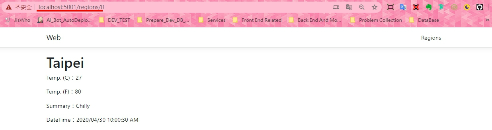

# NetCore.DPAPI.Demo
> 這個專案專注於利用 Data Protection API(DPAPI) 來達到資料保護機制。  
> This project focus on the use of **DPAPI** to achieve data protection.  

練習運用 DPAPI 實作資料保護機制於 .NET Core 3.1 上。  
To practice how use of DPAPI to implement data protection in .NET Core 3.1.  

## 準備作業  
> 專案有搭配 Angular 做前端呈現，所以建置專案時，應該會需要 Node.js 支援哦！  
This project build of .NET Core with Angular, [Node.js](https://nodejs.org/en/) may be necessary.  

## 運行專案
> 透過 Visual Studio 2019 或者利用 `dotnet run` 指令先把專案跑起來。
1. Run the project from Visual Studio 2019 or by typing `dotnet run` in a command window  

> 接著點擊"地區"連結。  
2. Then click region hyperlink.  

## 觀察資料保護前後的情形  
* 前  

* 後  

## 最後版本
1.0.0.0 (April 30, 2020)

## 記錄
* 1.0.0.0
  * Initial Commit (初次上版)

## 參考文章
* English
  * [ASP NET Core encryption and decryption example](https://www.youtube.com/watch?v=HlHDTQhVYoI)  
